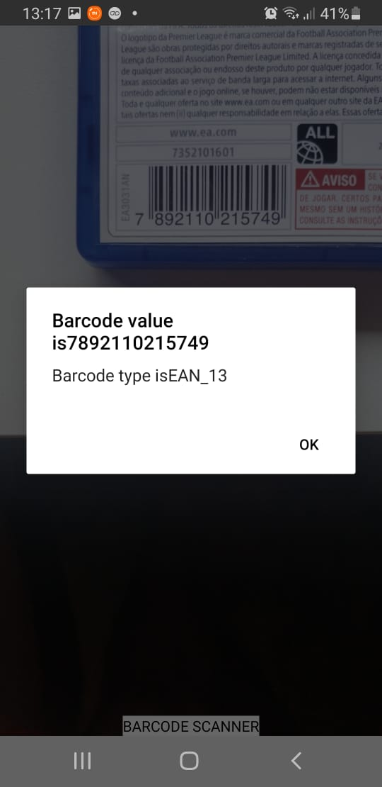

<h1> :iphone: BarCode Reader Tool :iphone: </h1>

  

## About this project

A React Native tool that identifies the type and info from barcode.

## Why ?

Providing a tool ready to complement any code that needs to read barcode information.

## Technologies

- JS
- React Native

## Installing

Clone this repository running the command: `$ git clone https://github.com/rnanc/BarCode_Reader_ReactNative.git`

Then run:

`$ yarn`

Now you can install it in your `android` or `ios` device by connecting it to your computer and running:

`$ yarn android` or `$ yarn ios`
